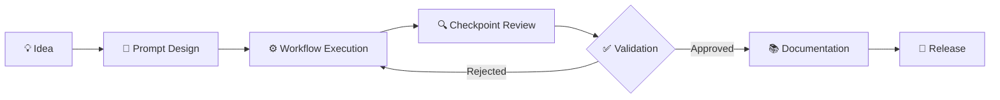

# starter-devsecops-ai-template

> ➡️ First brick of my HOMELAB System (starter-home-zero)

Minimal DevSecOps and AI starter template for fullstack projects.

This repository is a public showcase of the project.

The current objective : deliver a minimal reproducible workflow from idea to release.
 
The source code, development workflow and releases are maintained on **Codeberg** : 
☕️ [Codeberg : starter-devsecops-ia-template](https://codeberg.org/ITJonesy00/starter-devsecops-ia-template)

 📽 Overview 

 

 🔁 Checklist 

### Components 

- [x] Blueprint "HOMELAB system"
- [ ] A minimal example with release-check project  
- [ ] makefile worflow ?

### 🦇 Posts...✏️...
    
- [x] 《 How I Architect My Solo AI Workflow Lab ? 》
- [ ] 《 The evolution of my local AI governance framework 》

### CI

- [x] Pipeline observability system events Codeberg (minimal)

#### ✏️ Status actions

> ➡️ Next step : my environment setup

---

@ITJonesy00 - 2026

